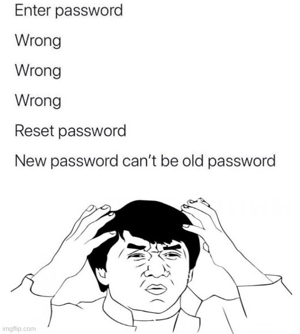
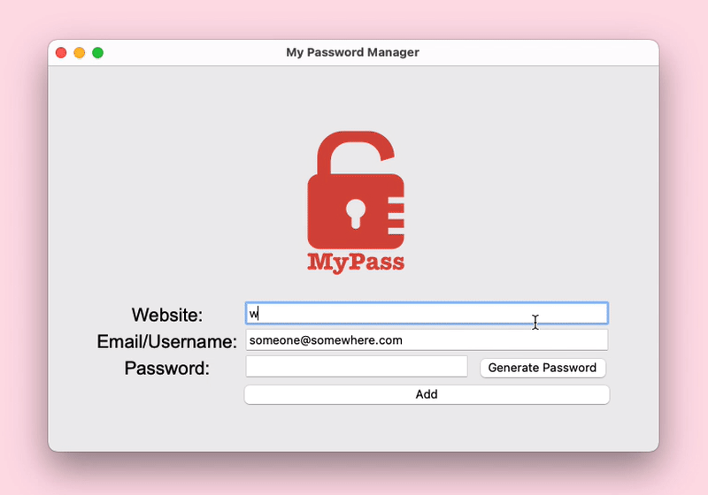
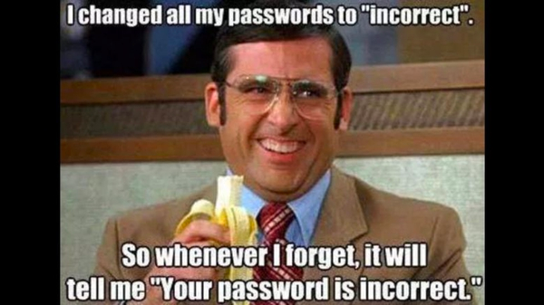

# About

A basic password manager starter project implemented in Python that saves your credentials locally and let's you generate a random password because we have all been here!

## App Preview

## Features:
- Fields you can save: Website, Email/Username, Password.
- Let's you generate a random password so you don't have to do this:
- 
- Generated password is automatically copied to your clipboard.
- Email/Username is prefilled with your most email/username. This value is hardcoded in the code. 
- The app validates your entries to make sure no field remains left empty.
- You are asked to confirm the credentials before the data is saved.

## Disclaimer ⚠️
This is just a starter project. Please do not use this to actually store your passwords. 🙅‍♀️ As passwords should be stored following **OWASP Password Storage recommendations** and this project does not incorporate those guidelines (yet?). Say in future if I was choose to upgrade this to incorporate hashing and encryption, I cannot say that I will also make the code available on a public repository for any hacker to look for vulnerabilities. 🤔

## Resources
If you wanted to build your own offline password storage, feel free to use this as a starter and you might wanna take a look at this:
https://cheatsheetseries.owasp.org/cheatsheets/Password_Storage_Cheat_Sheet.html